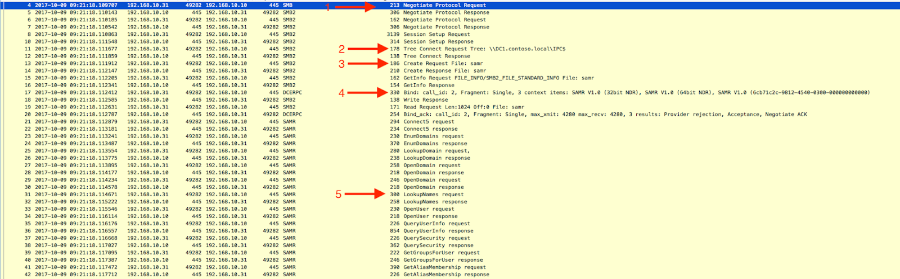

Of all the common protocols a new analyst encounters, perhaps none is quite as impenetrable as Server Message Block (SMB). Its enormous size, sparse documentation, and wide variety of uses can make it one of the most intimidating protocols for junior analysts to learn. But SMB is vitally important: lateral movement in Windows Active Directory environments can be the difference between a minor and a catastrophic breach, and almost all publicly available techniques for this movement involve SMB in some way. While there are numerous guides to certain aspects of SMB available, I found a dearth of material that was accessible, thorough, and targeted towards network analysis. The goal of this guide is to explain this confusing protocol in a way that helps new analysts immediately start threat hunting with it in their networks, ignoring the irrelevant minutiae that seem to form the core of most SMB primers and focusing instead on the kinds of threats an analyst is most likely to see. This guide necessarily sacrifices completeness for accessibility: further in-depth reading is provided in footnotes. There are numerous simplifications throughout to make the basic operation of the protocol more clear; the fact that they are simplifications will not always be highlighted. Lastly, since this guide is an attempt to explain the SMB protocol from a network perspective, the discussion of host based information (windows logs, for example) has been omitted. 

---

### The Basics

At its most basic, SMB is a protocol to allow devices to perform a number of functions on each other over a (usually local) network. SMB has been around for so long and maintains so much backwards compatibility that it contains an almost absurd amount of vestigial functionality, but its modern core use is simpler than it seems. For the most part, today SMB is used to map network drives, send data to printers, read and write remote files, perform remote administration, and access services on remote machines.

SMB runs directly over TCP (port 445) or over NetBIOS (usually port 139, rarely port 137 or 138). To begin an SMB session, the two participants agree on a dialect, authentication is performed, and the initiator connects to a `tree`. For most intents and purposes, the tree can be thought of as a network share1. The PCAP below, shown in Wireshark, demonstrates a simple session setup and tree connect. In this case, the machine `192.168.10.31` is connecting to the `c$` share (equivalent to the `C:\ drive`) on the `192.168.10.30` machine, which is called `admin-pc`.2

If you open this PCAP in wireshark and look at the packet details, you will find a lot of information, and it can sometimes be difficult to tell what is relevant. Fortunately, as analysts we are mostly unconcerned with the details of these setup packets (with the exception of those relevant to authentication, which is discussed below). For the most part it is sufficient to make note of the machine and share being accessed and move on. 

There are two special shares that you will see referenced often: the `IPC$` and `ADMIN$` shares. The `ADMIN$` share can basically be thought of as a symbolic link to the path `C:\Windows`.3 The `IPC$` share is a little different. It does not map to the file system directly, instead providing an interface through which remote procedure calls (RPC) can be performed, as discussed below.4

To get a better idea of how basic actions are performed with SMB, we’ll first take a look at a simplified version of a file copy. It looks like [this](https://github.com/401trg/detections/raw/master/pcaps/20171220_smb_mimikatz_copy.pcap):5
  

The first action we see is parsed by wireshark as `Create Request File`. In this instance, this tells `192.168.10.30` that `192.168.10.31` would like to create the file `mimikatz.exe`6 (1). It is important to note that this is the same command used to access a file, so seeing a `Create Request` doesn’t always mean that a file is being created. `192.168.10.31` retrieves some information about the filesystem it’s writing to with `GetInfo` (2), and then transmits some length information with `SetInfo` (3). Next `192.168.10.31` requests a number of writes to send the actual file bytes over (4). We append some metadata (including timestamps) to the complete remote file (5) and close it. Our file transfer is now complete. 

Reads work similarly; the following [PCAP](https://github.com/401trg/detections/raw/master/pcaps/20171220_smb_mimikatz_copy_to_host.pcap) shows the write operation exactly reversed. Host `192.168.10.31` is downloading mimikatz from host `192.168.10.30`. 

We begin by *creating* the request file again (1), though in this case it is an extant file that we are requesting a handle to. We use `GetInfo` to get a number of pieces of metadata from the file (2), and then make read requests for the actual file bytes (3). 

There are a large number of other SMB commands, but many of them are either rare or relatively self explanatory, and we won’t go into detail about them here.7 You may encounter `AndX` commands,8 which can be confusing at first. These simply allow two commands to be packaged as one, with one SMB header. For most purposes, you can treat them as two separate commands.

---

### Authentication

As security analysts, one of the details we are most interested in from SMB traffic is user/machine pairing. An unusual login on a device can be a thread that unravels an entire lateral movement attempt. In Windows Active Directory environments, there are two main ways that hosts authenticate to servers and each other: NTLM and Kerberos. NTLM, the older of the two, has been in use since the release of Windows NT in 1993 but remains supported in the latest versions of Windows.9 It uses a user’s password hash to encrypt a challenge it is sent by the device it is authenticating to. It is thus extremely vulnerable to pass-the-hash type attacks,10 and Kerberos is the recommended authentication protocol for Active Directory environments. NTLM continues to be used in Workgroup environments (Windows environments without domain controllers) and some older systems.11

Kerberos, introduced to Active Directory in Windows 2000, is a more modern and robust authentication protocol, but requires a Ticket Granting Server (TGS) to operate, usually on an Active Directory Domain Controller. A full explanation of Kerberos is beyond the scope of this paper,12 so we will instead focus on the two aspects of the protocol that are important for our discussion here. One, Kerberos authentication happens separately from SMB, and involves interaction with a TGS and the service you are attempting to authenticate to. Two, Kerberos tickets, used to access services on remote machines, do not contain user information that is useful to us in cleartext. 

Pass-the-hash attacks on NTLM and pass-the-ticket attacks on Kerberos13 can both be very difficult to detect at a network level, since the traffic often looks the same as legitimate use. It is key for network defenders to have an understanding of what users should be logged into which machines, as well as to maintain good discipline about which accounts are used to access which resources. SMB traffic analysis can sometimes help us with this. NTLM authentication, shown below, includes the user attempting to authenticate in cleartext.14

Depending on how you capture network traffic, it may or may not be possible to follow a Kerberos session. While the username is not included in the cleartext SMB authentication, you may be able to follow the initial authentication with the TGS and see the returned ticket being used in an SMB session. See [here](https://blogs.msdn.microsoft.com/openspecification/2017/05/26/smb-2-and-smb-3-security-in-windows-10-the-anatomy-of-signing-and-cryptographic-keys/) for more details. 

---

### RPC

One common use case for SMB is to make remote procedure calls (RPC) to another machine on a local network. This functionality can be used for a number of things, but we are especially interested in how it is used for things like user and group enumeration, which can be signs of attempted lateral movement. It’s important to note that RPCs can be made over raw TCP as well as over SMB, so absence of SMB traffic doesn’t mean absence of RPC. We’ll start by looking at a simple example of RPC over SMB which we might see if someone is attempting to enumerate all the users in our domain using the net command.15

This [PCAP](https://github.com/401trg/detections/raw/master/pcaps/20171220_smb_net_user.pcap) starts similarly to the others we’ve seen, with a protocol negotiation and session setup (1). Note that we are connecting to the `IPC$` share (2): this will be the tree we connect to for all RPC. Next, we `Create Request File`, (3) where the filename is the name of the service we are connecting to (in this case, the Security Accounts Manager (`SAMR`)). It is important to note that while Wireshark parses the SAMR protocol for us, in the case of a service it doesn’t recognize this filename would be very useful to us in identifying what we were querying. Next, we call an RPC bind and then formally connect to the service (4). Now that we’re connected to the service, Wireshark parses the individual commands sent to SAMR. We can see that `192.168.10.31` is attempting to enumerate the users in the domain through this service (5). 

We’ll look at one other simple example of RPC over SMB: using the at command to schedule a task on a remote computer.16 We’ll look at only part of the PCAP, from after the session has been set up and we have connected to the `IPC$` share. 

From a high level, this [PCAP](https://github.com/401trg/detections/raw/master/pcaps/20171220_smb_at_schedule.pcap) looks similar to the SAMR calls above. We create a request file with the name of the service (1) (atsvc, as we can see from the SMB Create Request File command), call an RPC `bind` (2), and then send a `JobAdd` request to the `at` service (3). There are a couple of things to note: one, since RPC runs on SMB in this case, each RPC command must have an SMB command associated with it. In this instance, RPC `bind` is on top of an SMB `write`, while the communication with the service happens over `ioctl/fsctl` commands.17 This can be a little confusing, so it can sometimes be best to think of it as three independent layers: the SMB, the RPC, and the service (in this case, ATSVC). Many RPC commands will ride on top of an SMB `ioctl` command, as we can see below. Assuming you are not tearing packets apart byte-by-byte, the SMB command is not hugely important: instead, focus on the RPC call or (if Wireshark can parse it) the service running on RPC.18

Wireshark parses the `at` scheduler service command for us, and we can see that the user is attempting to schedule mimikatz to run. 

---

### PSExec 

PsExec, a windows remote administration tool, has long been an attacker favorite for lateral movement in Active Directory environments. PsExec’s own website describes it as “a light-weight telnet-replacement that lets you execute processes on other systems, complete with full interactivity for console applications, without having to manually install client software. PsExec's most powerful uses include launching interactive command-prompts on remote systems and remote-enabling tools like IpConfig that otherwise do not have the ability to show information about remote systems.”19 While it is still commonly used for legitimate administration tasks, its extensive functionality makes it useful to attackers. It is worthwhile to keep an eye on all uses of it in your network, if it is deployed at all. 

PsExec can be fairly complicated on the wire, so we will begin by looking at two examples with some simplification. [The first](https://github.com/401trg/detections/raw/master/pcaps/20171220_smb_psexec_mimikatz_ticket_dump.pcap) shows PsExec being used to extract a file from a target machine.20

We first connect to the `ADMIN$` share (1) (which points to `C:\Windows`), and copy over the PSEXESVC.exe file (2). This is an executable which will eventually be run on the target machine as a temporary service. We then connect to the `IPC$` share (3) (note that we don’t need to do another session setup for this to happen). Since Wireshark can’t parse the `PSEXESVC` (like it could `ATSVC` and `SAMR`) at time of writing, we see the raw `ioctl` request (4), `FSCTL_PIPE_TRANSCEIVE`, instead of it being decoded into service specific commands. We then open (or more accurately, `FSCTL_PIPE_WAIT` on21) the service’s `stdin` (5), `stdout` (6), and `stderr` (7), and then start reading the actual file from `stdout` (8). As of version 2.1, PsExec encrypts all communication between the local and remote machines, so we can’t glean much more insight from this PCAP. 

[The next example](https://github.com/401trg/detections/raw/master/pcaps/20171220_smb_psexec_add_user.pcap) we’ll look at is using PsExec to add a user to a remote machine, and looks fairly different. The initial setup is similar, we connect to the `ADMIN$` share (1) and copy over the `PSEXESVC.exe` file (2), though in this case we then completely disconnect.

However, when we reconnect to the `IPC$` share (1), we launch PsExec via an RPC call to the `SVCCTL` service (as opposed to sending an `ioctl` to the `PSEXESVC` pipe, as we did above) (2) and then connect to the `stdin`, `stdout` and `stderr` as before (3).

The metasploit framework (https://www.metasploit.com/) also contains its own version of PsExec which works a little differently under the hood.22 In this [PCAP](https://github.com/401trg/detections/raw/master/pcaps/20171220_smb_metasploit_psexec_pth_download_meterpreter.pcap), we’re using it to pass some NTLM credentials we stole across SMB and then download [meterpreter](https://www.offensive-security.com/metasploit-unleashed/about-meterpreter/) to a target machine. 

This is the unabridged PCAP and it shows just how efficient this module is at transmitting a payload. You’ll notice it makes extensive use of `AndX` commands. On further inspection, however, you’ll see that all of the `AndX` commands are "No further commands," meaning we’re only sending one command. It is possible that the `AndX` commands are used for evasion. 

We perform a normal NTLM authentication (1) and then connect to the `IPC$` (2) and `ADMIN$` (3) shares (note that in this case we are connecting to them both simultaneously, unlike the previous two examples). We then attempt to open the PowerShell executable on the remote machine (4). This is metasploit checking for the presence of PowerShell so it doesn’t have to send over the `PSEXESVC` executable, which some solutions may detect as malicious. It successfully finds it (5), connects to the `SVCCTL` service (6), and then transfers a file over (7). It creates (8) and starts a service (9), then cleans up (10) and disconnects (11). If we inspect the service creation, we can actually see the PowerShell command that spawns a meterpreter loader. 

Though the command is truncated in wireshark, in the raw packet bytes we can see it is meant to decode and execute shellcode. 

---

### Lateral Movement Techniques

So far we’ve looked at a number of individual examples of potentially malicious behavior over SMB, but we have not looked at any big picture techniques of how attackers might actually traverse a network. There are of course quite a number of potential strategies to this, but one relatively common technique I’d like to focus on is both easy to perform and relatively difficult to detect. Since Windows stores some credentials (either Kerberos tickets or NTLM hashes) in memory for logged on users, an attacker can sometimes gain more valuable credentials by gaining local Admin on a box, dumping the Kerberos tickets or NTLM hashes from memory, and then impersonating that user to move to another machine that they have access to. That process can then potentially be repeated on another machine. This requires only mimikatz and legitimate Windows tools, and so defender knowledge of appropriate machine/user pairings and proper access controls are essential. SMB analysis can also help us in a couple ways. First, inspecting SMB for unusual authentication can give us a hint when something isn’t right. If our network uses Kerberos, but we see an NTLM authentication between two machines, something is definitely up. Secondly, a technique like the one above often involves a lot of reconnaissance, because it is essential for attackers to know which users have what permissions and who is logged into what machines. Attackers can sometimes create enumeration noise while trying to figure this out (though enumeration tools do have a number of legitimate uses), and seeing unusual RPC calls related to user permissions, group memberships, or active sessions can sometimes indicate compromise.23

A good attacker can move almost silently through your network, and even when you are armed with knowledge of SMB, they can sometimes evade detection. Windows Management Instrumentation (WMI) and PowerShell remoting are two techniques that can avoid using SMB altogether and perform some of the same functionality we’ve discussed.24 No one indicator we’ve seen in this post indicates malicious behavior on its own, but as with any protocol, a good knowledge of what normal SMB traffic looks like in your network is critical for finding anomalous behavior that might be attacker related. I hope this guide has been a useful introduction and you can use some of the tools you’ve learned here to begin hunting in your network.25

*Written by Nate Marx, Threat Researcher, ProtectWise.*

---

1 A network share is some sort of shared resource on the network. Think of a drive or folder accessible over the network. 

2 This network setup may look familiar to you. This and all the PCAPs referenced in this document are loosely based on the lab setup in the fantastic Microsoft Advanced Threat Analytics Attack Simulation Playbook here: [https://gallery.technet.microsoft.com/ATA-Playbook-ef0a8e38](https://gallery.technet.microsoft.com/ATA-Playbook-ef0a8e38) . This is a great resource whether you use ATA in your environment or not.

3 For further reading, see here: [http://www.intelliadmin.com/index.php/2007/10/the-admin-share-explained/](http://www.intelliadmin.com/index.php/2007/10/the-admin-share-explained/)

4 For further info, see here: [http://smallvoid.com/article/winnt-ipc-share.html](http://smallvoid.com/article/winnt-ipc-share.html) and here: [https://support.microsoft.com/en-us/help/3034016/ipc-share-and-null-session-behavior-in-windows](https://support.microsoft.com/en-us/help/3034016/ipc-share-and-null-session-behavior-in-windows)

5 The added complexity in the full PCAP comes from two things: creating and setting the appropriate metadata of the C:\temp folder, and adding metadata to the received mimikatz file and \tmp directory.

6 The phenomenal mimikatz tool, by Benjamin Delpy, is an essential part of every security researcher’s toolbox. It can be found here: [https://github.com/gentilkiwi/mimikatz](https://github.com/gentilkiwi/mimikatz). Precompiled versions are available here: [https://github.com/gentilkiwi/mimikatz/releases](https://github.com/gentilkiwi/mimikatz/releases)

7 For more information, see here: [https://msdn.microsoft.com/en-us/library/ee441741.aspx](https://msdn.microsoft.com/en-us/library/ee441741.aspx).

8 [https://msdn.microsoft.com/en-us/library/ee442210.aspx](https://msdn.microsoft.com/en-us/library/ee442210.aspx)

9 [https://docs.microsoft.com/en-us/windows-server/security/kerberos/ntlm-overview](https://docs.microsoft.com/en-us/windows-server/security/kerberos/ntlm-overview)

10 See [http://www.harmj0y.net/blog/redteaming/pass-the-hash-is-dead-long-live-localaccounttokenfilterpolicy/](http://www.harmj0y.net/blog/redteaming/pass-the-hash-is-dead-long-live-localaccounttokenfilterpolicy/) for more details.

11 See [https://blogs.msdn.microsoft.com/chiranth/2013/09/20/ntlm-want-to-know-how-it-works/](https://blogs.msdn.microsoft.com/chiranth/2013/09/20/ntlm-want-to-know-how-it-works/) for further details.

12 See here for more details: [http://www.roguelynn.com/words/explain-like-im-5-kerberos/](http://www.roguelynn.com/words/explain-like-im-5-kerberos/)

13 See here for more information: [https://technet.microsoft.com/en-us/dn785092.aspx](https://technet.microsoft.com/en-us/dn785092.aspx)

14 This PCAP is taken from the wireshark website, it is “smb-on-windows-10.PCAPng”

15 The exact command being run in this PCAP is “net user /domain”.

16 [https://support.microsoft.com/en-us/help/313565/how-to-use-the-at-command-to-schedule-tasks](https://support.microsoft.com/en-us/help/313565/how-to-use-the-at-command-to-schedule-tasks)

17 [https://msdn.microsoft.com/en-us/library/cc246545.aspx](https://msdn.microsoft.com/en-us/library/cc246545.aspx)

18 This is a significant simplification. The SMB command does ultimately matter and has implications for how the data is passed to the RPC call and the service at a low level. Fully discussing this is beyond the scope of this guide, but I encourage every reader to carefully inspect the RPC calls in each PCAP to see how the SMB, RPC, and service commands relate.

19 [https://docs.microsoft.com/en-us/sysinternals/downloads/psexec](https://docs.microsoft.com/en-us/sysinternals/downloads/psexec_

20 The exact command being run is: psexec.exe \\admin-pc -accepteula cmd /c (cd c:\temp ^& mimikatz.exe “privilege::debug” “sekurlsa::tickets /export” “exit”) (see the ATA playbook above)

21 [https://msdn.microsoft.com/en-us/library/cc232126.aspx](https://msdn.microsoft.com/en-us/library/cc232126.aspx)

22 [https://www.offensive-security.com/metasploit-unleashed/psexec-pass-hash/](https://www.offensive-security.com/metasploit-unleashed/psexec-pass-hash/)

23 See [https://www.sixdub.net/?p=591](https://www.sixdub.net/?p=591) for an excellent discussion of a similar lateral movement technique.

24 WMI can use RPC over TCP, and powershell remoting can be run over Windows Remote Management (WinRM), which is HTTP based. See [https://technet.microsoft.com/en-us/library/ff700227.aspx](https://technet.microsoft.com/en-us/library/ff700227.aspx) for more details on powershell remoting.

25 [http://www.harmj0y.net/blog/](http://www.harmj0y.net/blog/) is a fantastic resource to begin expanding your knowledge of Active Directory attack techniques. [http://adsecurity.org/](http://adsecurity.org/) is another excellent source.
