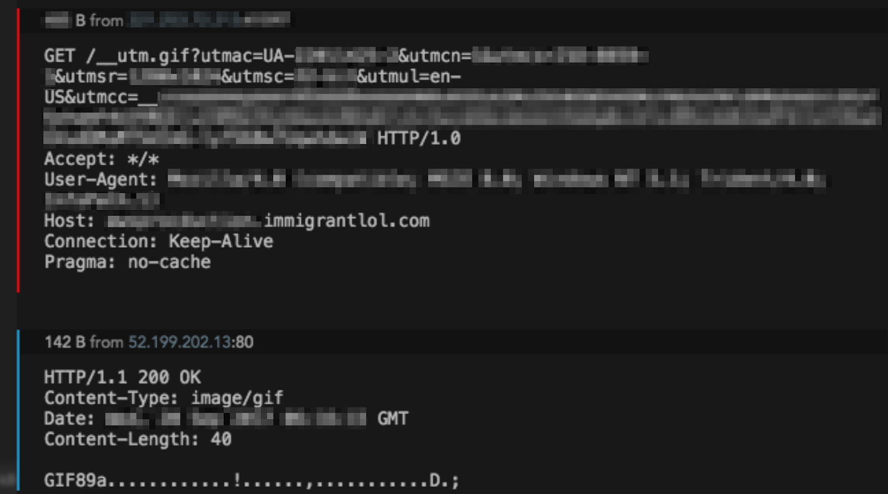
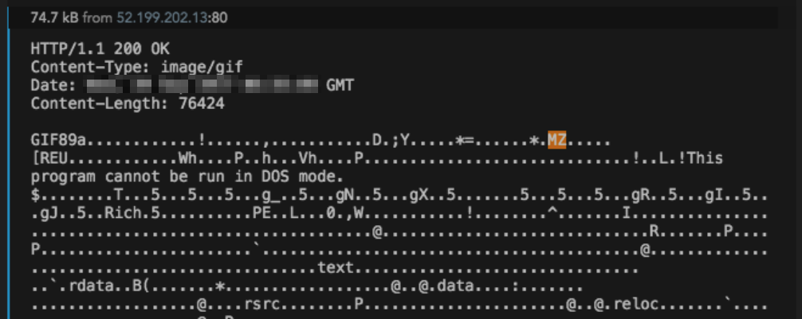

In our recent post "[Winnti Evolution - Going Open Source]"(https://401trg.github.io/pages/winnti-evolution-going-open-source.html), we shared new details on the Winnti APT group and their continued targeting of online gaming organizations. The purpose of this follow-up post is to share some new information about  the group and their continued activities. 

The group continues to primarily use publicly available pentesting tools outside of the US. In the multiple incidents we have been involved in, the group has relied heavily on BeEF and Cobalt Strike. Cobalt strike has been their primary toolset for command and control within the victim networks, while BeEF has been used to assist in the initial infection process.

On the network traffic analysis end, post compromise activity results in some interesting but not unexpected activity. First, Winnti uses Cobalt Strike to collect credentials and move laterally. The stolen credentials may be used for remote access into the victim network if applicable. The group also continues to focus on theft of code signing certificates and internal documentation, including company files and internal communication history (chats/emails).

In multiple incidents, we found the attackers were using the “[webbug_getonly](https://github.com/rsmudge/Malleable-C2-Profiles/blob/master/normal/webbug_getonly.profile)” malleable C2 profile, which masks itself as a Google Web Bug and performs both directions of communication using only HTTP GETs. The profile encrypts then encodes victim metadata after the “utmcc” parameter, with “__utma” appended to the front. When not sending a command or file, the server responds with a small GIF (See Figure 1).

Figure 1: Cobalt Strike beacon example

When the server has commands or data to send the infected client, it responds with more data appended to the same small GIF it normally uses (see Figure 2). We also observed updated Cobalt Strike binaries being sent this way, typically in the clear.

Figure 2: Example C2 response containing new Cobalt Strike binary. 

We’ll continue to monitor the Winnti group and share any new details when possible. 

References:
1. [ProtectWise - Winnti Evolution - Going Open Source](https://401trg.github.io/pages/winnti-evolution-going-open-source.html)
2. [Trend Micro 2017 Winnti Report](http://blog.trendmicro.com/trendlabs-security-intelligence/winnti-abuses-github/)
3. [Bluecoat / Symantec - 2014 Winnti Report](https://www.bluecoat.com/en-gb/security-blog/2014-07-21/korean-gaming-industry-still-under-fire)  
4. [Kaspersky Lab - 2013 Winnti Report](https://kasperskycontenthub.com/wp-content/uploads/sites/43/vlpdfs/winnti-more-than-just-a-game-130410.pdf)

*Written by Tom Hegel, Senior Threat Researcher, Protectwise*
