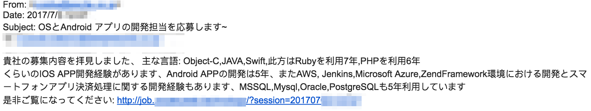
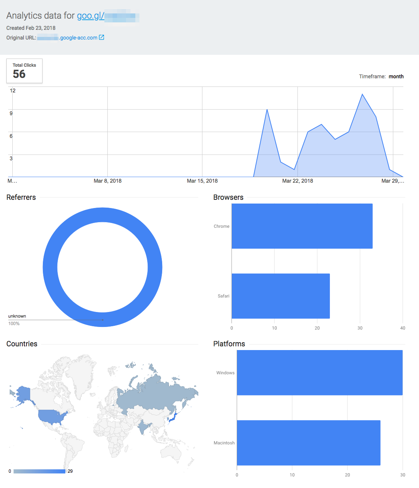
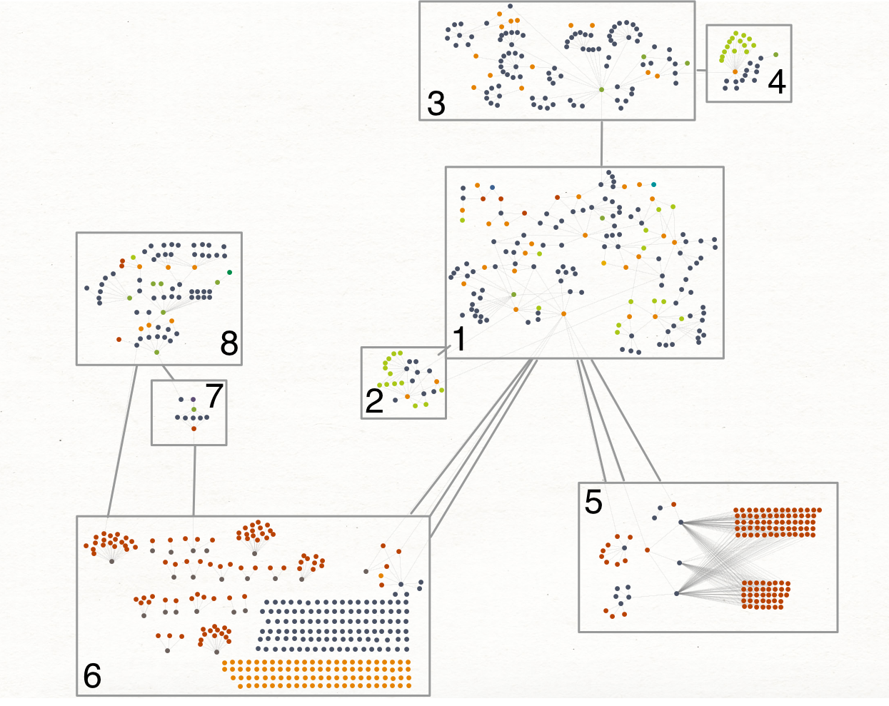

> #### An Intelligence Report on the Winnti Umbrella and Associated State-Sponsored Attackers

## Key Judgements:
 
- We assess with high confidence that the Winnti umbrella is associated with the Chinese state intelligence apparatus, with at least some elements located in the Xicheng District of Beijing.
- A number of Chinese state intelligence operations from 2009 to 2018 that were previously unconnected publicly are in fact linked to the Winnti umbrella.
- We assess with high confidence that multiple publicly reported threat actors operate with some shared goals and resources as part of the Chinese state intelligence apparatus.
- Initial attack targets are commonly software and gaming organizations in the United States, Japan, South Korea, and China. Later stage high profile targets tend to be politically motivated or high value technology organizations. 
- The Winnti umbrella continues to operate highly successfully in 2018. Their tactics, techniques, and procedures (TTPs) remain consistent, though they experiment with new tooling and attack methodologies often. 
- Operational security mistakes during attacks have allowed us to acquire metrics on the success of some Winnti umbrella spear phishing campaigns and identify attacker locations with high confidence.
- The theft of code signing certificates is a primary objective of the Winnti umbrella’s initial attacks, with potential secondary objectives based around financial gain.

## Report Summary

The purpose of this report is to make public previously unreported links that exist between a number of Chinese state intelligence operations. These operations and the groups that perform them are all linked to the Winnti umbrella and operate under the Chinese state intelligence apparatus. Contained in this report are details about previously unknown attacks against organizations and how these attacks are linked to the evolution of the Chinese intelligence apparatus over the past decade. Based on our findings, attacks against smaller organizations operate with the objective of finding and exfiltrating code signing certificates to sign malware for use in attacks against higher value targets. Our primary telemetry consists of months to years of full fidelity network traffic captures. This dataset allowed us to investigate active compromises at multiple organizations and run detections against the historical dataset, allowing us to perform a large amount of external infrastructure analysis. 

## Background

The Winnti umbrella and closely associated entities have been active since at least 2009, with some reports of possible activity as early as 2007. The term "umbrella" is used in this report because current intelligence indicates that the overarching entity consists of multiple teams/actors whose tactics, techniques, and procedures align, and whose infrastructure and operations overlap. We assess that the different stages of associated attacks are operated by separate teams/actors, however in this report we will show that the lines between them are blurred and that they are all associated with the same greater entity. The Winnti and Axiom group names were created by Kaspersky Lab and Symantec, respectively, for their 2013/2014 reports on the original group. The name “Winnti” is now primarily used to refer to a custom backdoor used by groups under the umbrella. Multiple sources of public and private threat intelligence have their own names for individual teams. For example, LEAD is a common alias for the group targeting online gaming, telecom, and high tech organizations. Other aliases for groups related include BARIUM, Wicked Panda, GREF, PassCV, and others. This report details how these groups are linked together and serve a broader attacker mission. The many names associated with actors in the greater intelligence mission are due to the fact that they are built on telemetry of the intelligence provider which is typically unique and dependent on their specific dataset. This report focuses heavily on networking related telemetry. 

We assess with high confidence that the attackers discussed here are associated with the Chinese state intelligence apparatus. This assessment is based on attacker TTPs, observed attack infrastructure, and links to previously published intelligence. Their operations against gaming and technology organizations are believed to be economically motivated in nature. However, based on the findings shared in this report we assess with high confidence that the actor’s primary long-term mission is politically focused. It’s important to note that not all publicly reported operations related to Chinese intelligence are tracked or linked to this group of actors. However, TTPs, infrastructure, and tooling show some overlap with other Chinese-speaking threat actors, suggesting that the Chinese intelligence community shares human and technological resources across organizations. We assess with medium to high confidence that the various operations described in this report are the work of individual teams, including contractors external to the Chinese government, with varying levels of expertise, cooperating on a specific agenda. 

In 2015 the People’s Liberation Army of China (PLA) began a major reorganization which included the creation of the Strategic Support Force (SSF / PLASSF). SSF is responsible for space, cyber, and electronic warfare missions. Some of the overlap we observed from groups could potentially be related to this reorganization. Notably, key incident details below include attacker mistakes that likely reveal the true location of some attackers as the Xicheng District of Beijing. 

#### Tactics, Techniques, and Procedures (TTPs):

Though the TTPs of the attacking teams vary depending on the operation, their use of overlapping resources presents a common actor profile. Key interests during attacks often include the theft of code signing certificates, source code, and internal technology documentation. They also may attempt to manipulate virtual economies for financial gain. While unconfirmed, the financial secondary objective may be related to personal interests of the individuals behind the attacks.

Initial attack methods include phishing to gain entry into target organization networks. The group then follows with custom malware or publicly available offensive tooling (Metasploit/Cobalt Strike), and may use a number of methods to minimize their risk of being detected. Such techniques include a particular focus on “living off the land” by using a victim's own software products, approved remote access systems, or system administration tools for spreading and maintaining unauthorized access to the network.

We have observed incidents where the attacker used other victim organizations as a proxy for unauthorized remote access. In these cases, organization 1 had been compromised for a long period of time, and the attacker accessed victim organization 2 via the organization 1 network. 

Delivery and C2 domains routinely have subdomains which resemble target organizations. Additionally, their C2 domains are used across many targets, while subdomains tend to be created and removed quickly and are unique to a particular target or campaign. Also noteworthy is that the actors set their domains to resolve to `127.0.0.1` when not in use, similar to what was originally reported on by Kaspersky Lab (see below). 

The actor often uses TLS encryption for varying aspects of C2 and malware delivery. As noted in the “Infrastructure Analysis” section of this report, the actor primarily abuses Let’s Encrypt to sign SSL certificates. We also observed many cases in which self-signed certificates were used in attacks.

Overall, the Winnti umbrella and linked groups are lacking when it comes to operational security. However, some activities linked to these groups follow better operational security and infrastructure management approaches. This may be a clue to the division of responsibilities by team and skill level within the broader organization. 

#### Targets:

The Winnti umbrella and linked groups’ initial targets are gaming studios and high tech businesses. They primarily seek code signing certificates and software manipulation, with potential financially motivated secondary objectives. These targets have been identified in the United States, Japan, South Korea, and China.

Based on the infrastructure, links to previous reporting, and recently observed attacks, the broader organization’s main targets are political. Historically this has included Tibetan and Chinese journalists, Uyghur and Tibetan activists, the government of Thailand, and prominent international technology organizations.

One example of a politically focused lure by the Winnti umbrella and linked groups is an end of 2017 document titled “Resolution 2375 (2017) Strengthening Sanctions on DPR of KOREA” which is a malicious file associated with the C2 infrastructure described here - see MD5: 3b58e122d9e17121416b146daab4db9d.

 
#### Some Key Public Reports:

***2013:*** 

Kaspersky Lab publicly reported [on the original Winnti group](https://securelist.com/winnti-more-than-just-a-game/37029/), technical details around the [Winnti samples](https://securelist.com/winnti-1-0-technical-analysis/37002/), and [various honeypot analysis methods](https://securelist.com/the-winnti-honeypot-luring-intruders/35623/). Most noteworthy is the Winnti umbrella’s targeting of gaming organizations in search of code signing certificates, virtual currencies, and updating mechanisms which could potentially be used to attack victims’ clients. Interestingly, this was the first identified trojan for the 64-bit Microsoft Windows operating system with a valid digital signature as noted by the author. The abuse of signed applications is a very effective attack approach that the entity continues to use. 

***2014:***

Novetta released an [outstanding report detailing “Operation SMN,”](http://www.novetta.com/wp-content/uploads/2014/11/Executive_Summary-Final_1.pdf) in which they collaborated with a number of private organizations on a large-scale malware eradication operation which is linked to the original Winnti group by the malware being delivered. In the report, the actor is named Axiom. Novetta reported links to publications from as far back as 2009 that also link the group to the Chinese state intelligence apparatus with high confidence. Links exist to various known attacks and actor groups, such as “Operation Aurora,” Elderwood Group’s successful 2010 attack against Google and many other organizations. Another link exists to the successful compromise of the security organization [Bit9 in 2013](https://krebsonsecurity.com/2013/02/security-firm-bit9-hacked-used-to-spread-malware/), where their own product was used to sign and spread malware to their customers. In addition, [FireEye’s “Operation DeputyDog”](https://www.fireeye.com/blog/threat-research/2013/09/operation-deputydog-zero-day-cve-2013-3893-attack-against-japanese-targets.html) detailed attacks on Japanese targets from the same attack infrastructure. Many other incidents are detailed in the Operation SMN report. Following all of these details back in time, we can see an overlap in TTPs and targets from the [APT1 report by Mandiant](https://www.fireeye.com/content/dam/fireeye-www/services/pdfs/mandiant-apt1-report.pdf), which serves as a great historical example of Chinese intelligence cyber operations in their most basic form.

***2016:***

Cylance [released a blog post](https://blog.cylance.com/digitally-signed-malware-targeting-gaming-companies) reporting on digitally signed malware used in targeted attacks against gaming organizations in China, Taiwan, South Korea, Europe, Russia, and the United States. Cylance refers to the attacking entity as “PassCV” in their reporting. Cylance successfully identified a large quantity of malware binaries which were signed with valid certificates stolen from a number of gaming studios in East Asia. In addition to detailing the individual certificates and signed malware, they identified a significant amount of network infrastructure which contained various interesting links to our own findings. 

***2017 - March/April:***

[Trend Micro reported](https://blog.trendmicro.com/trendlabs-security-intelligence/winnti-abuses-github/) on attacks that abused GitHub for use in malware command and control, which they attributed to the original Winnti group. Amusingly, Trend Micro later reported on an individual linked to the group and the attacks who happens [to be a fan of pigs.](https://blog.trendmicro.com/trendlabs-security-intelligence/pigs-malware-examining-possible-member-winnti-group/)

***2017 - July 5th:***

[Citizen Lab reported](https://citizenlab.ca/2017/07/insider-information-an-intrusion-campaign-targeting-chinese-language-news-sites/) on attacks against journalists by an actor mimicking China-focused news organizations HK01, Epoch Times, Mingjing News, and Bowen Press. As Citizen Lab noted, these news organizations are blocked in China for their political views. The report notes that malware used in these attacks was linked to a stolen code signing certificate mentioned in the Cylance PassCV post. That overlap, in addition to infrastructure links from [a Palo Alto Unit 42 blog post](https://researchcenter.paloaltonetworks.com/2015/11/attack-campaign-on-the-government-of-thailand-delivers-bookworm-trojan/), strongly links this attack to the previously mentioned reports as well as to our own. As Unit 42 reports, the attacks against entities in the government of Thailand used the “bookworm” trojan.

***2017 - July/October:***

[ProtectWise 401TRG published our own findings](https://401trg.github.io/pages/winnti-evolution-going-open-source.html) and [an update](https://401trg.github.io/an-update-on-winnti.html) on LEAD using open source and public tooling in attacks against Japanese gaming organizations. These attacks are linked with high confidence to ongoing operations in the United States and East Asia. 

***Other Noteworthy Events:***

In 2017, multiple supply-chain attacks occurred which had some similarities to the Winnti umbrella and associated entities. For example, [Kaspersky reported on ShadowPad](https://securelist.com/shadowpad-in-corporate-networks/81432/), a large-scale compromise of NetSarang, which resembles the Winnti and PlugX malware. In addition, [Kaspersky](https://twitter.com/craiu/status/910059453948579840?ref_src=twsrc%5Etfw&ref_url=https%3A%2F%2Fwww.intezer.com%2Fevidence-aurora-operation-still-active-supply-chain-attack-through-ccleaner%2F&tfw_creator=IntezerLabs&tfw_site=IntezerLabs) and [Intezer](http://www.intezer.com/evidence-aurora-operation-still-active-supply-chain-attack-through-ccleaner/) identified notable code similarities to the Winnti umbrella and APT17 in the compromise of Piriform, which allowed attackers to sign and spread altered versions of the CCleaner software to a large customer base. 

## Analysis of Attacks on Initial Targets

Throughout 2017 and 2018, ProtectWise 401TRG was involved in a number of detection and incident response engagements with our customers that linked back to the Winnti umbrella and other closely associated entities. Through the analysis of public and private intelligence, we have successfully identified similar attacks, which allow us to assess with high confidence that the details below follow a global attack trend as the Chinese intelligence operations have evolved over time.

***2017 Operations:***

One of the most common tactics used by the Winnti umbrella and related entities is phishing users whose credentials may provide elevated access to a target network. We have observed spear-phishing campaigns that target human resources and hiring managers, IT staff, and internal information security staff, which are generally very effective. 

In 2017 the entity focused most of its efforts around technical job applicant email submissions to software engineering, IT, and recruiting staff, which we originally reported on [here](https://401trg.github.io). The phishing lures used multiple languages, including Japanese as in the below example: 

 
The approximate translation is as follows:

> I saw your job posting. My main languages are Object-C, JAVA, and Swift, and I have 7 years experience with Ruby and 6 years experience with PHP. I have 5 years  experience developing iOS apps, as well as Android apps, AWS, Jenkins, Microsoft Azure, ZendFramework, and smartphone application payment processing. I also have 5 years experience with MSSQL, Mysql, Oracle, and PostgreSQL. Please see here: [malicious link] 

The process that followed a target clicking the malicious link evolved as the attacker progressed through the campaigns. The links consistently sent the victim to a fake resume, but the exact format of that resume changed over time; we have observed resumes being delivered as DOC, XLS, PDF, and HTML files. Once opened, the fake resumes performed various actions in an effort to download malware onto the victim host. During the same time period, we also observed the actor using the Browser Exploitation Framework (BeEF) to compromise victim hosts and download Cobalt Strike. In this campaign, the attackers experimented with publicly available tooling for attack operations. During this infection process, the actor was known to check the target operating system and deliver malware, signed by a previously stolen key, for the appropriate host environment. In some cases, valid Apple certificates stolen from victims were used in this process, which linked the attack to additional victim organizations. 

Post-compromise actions by the attacker followed a common pattern. First they attempted to spread laterally in the network using stolen credentials and various reconnaissance efforts, such as manually examining shares and local files. The primary goal of these attacks was likely to find code-signing certificates for signing future malware. The secondary goals of the attackers depended on the type of victim organization, but were often financial. For example, gaming organizations tended to fall victim to manipulation or theft of in-game virtual currencies. Non-gaming victims may have experienced theft of intellectual property such as user or technology data. 

***2018 Operations:***

More recently, various attack campaigns from the Winnti umbrella and associated groups have been very successful without the use of any exploits or malware. Phishing remains the initial infection vector but the campaign themes have matured. In 2018, the campaigns have largely been focused on common services such as Office 365 and Gmail. 

It is important to note that attackers likely have additional information on their target organizations' preferred email solutions based on previous incidents or open source intelligence. 

In more recent phishing campaigns conducted by the Winnti umbrella and associated groups, URL shortening services have been used. For example, Google’s URL shortening service goo.gl was used over the past weeks, allowing us to gain insight into the scale of this campaign using publicly available analytics.

As you can see from the above screenshot, this particular phishing campaign ran from March 20th to March 28th, 2018. Notably, the link was created on February 23rd, 2018, indicating roughly three weeks of preparation for the attacks. These metrics allow us to gain insight into who clicked the link in a phishing email and was directed to a phishing or malware delivery landing page. According to Google analytics, there were a total of 56 clicks. 29 were from Japan, 15 from the United States, 2 from India, and 1 from Russia. 33 of the clicks were from Google Chrome, and 23 were from Safari. 30 were from Windows OS hosts, and 26 were macOS hosts. 

In general, the attackers phish for credentials to a user’s cloud storage, and would be expected to later attempt malware delivery in the cases of a failed credential phish or valueless cloud storage.

In cases where the victim uses O365 and/or G-suite for enterprise file storage, the attackers manually review the contents for data of value. If code signing certificates are stored here, the primary mission has been accomplished, as they may be easily downloaded. In other cases, the attackers attempt to use other files and documentation in the cloud storage to help them traverse or gain privileges on the network. The targets in 2018 include IT staff, and commonly sought out files include internal network documentation and tooling such as corporate remote access software. 

Once the attackers gain remote access to the network via malware or stolen remote access tooling and credentials, the operation continues as we’ve seen, though their post-compromise actions have become more efficient and automated. Internal reconnaissance is performed by scanning the internal network for open ports 80, 139, 445, 6379, 8080, 10022, and 30304. The choice of ports by the attacker indicates a strong interest in internal web and file storage services. An interesting addition is the use of 30304, which is the peer discovery port for Ethereum clients.

In the attackers’ ideal situation, all remote access occurs through their own C2 infrastructure, which acts as a proxy and obscures their true location. However, we have observed a few cases of the attackers mistakenly accessing victim machines without a proxy, potentially identifying the true location of the individual running the session. In all of these cases, the net block was `221.216.0.0/13`, the China Unicom Beijing Network, Xicheng District. 

## Visualizing Attacker Infrastructure

Based on the various incidents we have been involved in, in addition to past public reporting and open-source intelligence, we can construct a map representing the infrastructure most closely associated with the Winnti umbrella and closely related entities. For the sake of producing an accurate representation of the infrastructure, we are excluding any shared infrastructure (such as hosting provider IPs used for many unrelated domains) and low confidence indicators. Please note this is not an exhaustive list of all active infrastructure in use by the group.

As detailed below, this infrastructure spans at least eight years of activity by the Winnti umbrella and related groups. Please note, as this section heavily references the “Some Key Public Reports” section, above, we recommend reading that first.

1. The area of the map labeled #1 is the phishing, malware delivery, fake resume, and C2 infrastructure. This includes domains, IPs, malware hashes, SSL certificates, and WHOIS information. In this section of the infrastructure, we primarily observe the network and file indicators which would be used against targets valued for code signing certificates, software manipulation, and potential financial manipulation. The indicators detailed in the 2017 & 2018 Initial Target section of this report are located in #1. Infrastructure in this area is currently in use and not entirely historical.
2. This area is a network that we assess is associated with the umbrella with low confidence. The most interesting findings here are the large number of Let’s Encrypt SSL certificates in use and the overlap with attacker exclusive infrastructure. This proposed relationship is generated by infrastructure links alone, as no malicious activity has been confirmed to or from region #2. Infrastructure in this area is currently in use and not historical. 
3. Area #3 is linked to the initial attack infrastructure (#1) by domain WHOIS details, likely from operational security mistakes. We assess with high confidence that these infrastructures are linked. Based on the lax structure and naming of this section, it is highly probable that it is used for attacker experimenting and development. Some examples include domains such as `nobody.will.know.whoami[.]la`, `secret.whoami[.]la`, and `no.ip.detect.if.using.ipv6[.]la`. Infrastructure in this area is currently in use and not historical. 
4. This area has various links to #3 in which an individual software developer is identified. We assess this connection with low to medium confidence and will refrain from publicly sharing details in this report. This area contains many personally operated domains and SSL certificates. Infrastructure in this area is currently in use and not historical. 
5. Area #5 of the map is part of what Novetta reported on as Operation SMN in 2014. Infrastructure in this area is purely historical and based on Novetta’s reporting, which we can link to area #1 via known umbrella infrastructure. The vast majority of indicators in this area are the [many associated hashes](http://www.novetta.com/wp-content/uploads/2014/11/Hashes.txt), combined with their C2 destination domains and IPs.
6. This area of the map is what Cylance reported on as PassCV in 2016. The vast majority of infrastructure and indicators here are stolen code signing certificates, malware signed with the certificates, and C2 domains. This area contains information on many victims of campaigns related to area #1. Infrastructure in this area is historical. We assess that this area is linked to the Winnti umbrella with high confidence. 
7. This section represents infrastructure identified by Citizen Lab in their July 5th 2017 reporting on attacks against journalists. As they originally identified, one of the NetWire binaries was signed with a stolen certificate linked to #6, the Cylance PassCV report. We were able to further expand this section by pivoting off of additional domain WHOIS information. 
8. Lastly is area #8, which links back with high confidence to #7 (Citizen Lab reporting) and #6 (PassCV). This area consists of domains, IPs, MD5 file hashes, and further WHOIS operational security mistakes. This area is similar in functionality to #1 and #3, serving as infrastructure for both high-value politically focused attacks and developer personal use. This section links to the online identities of an individual we assess to be associated with the Winnti umbrella or a closely related group at a medium to high confidence. Infrastructure in this area is currently in use and not historical. One example of malicious activity in this area was the document detailing the strengthening of sanctions against North Korea, above. These activities are similar to the type of politically motivated targeted attacks Citizen Lab reported on. Some infrastructure in this area is currently in use and is not completely historical. 

 
## Investigative Findings
 
Based on incident response engagements, research into the associated attacker infrastructure, and previously reported research, we can summarize our findings as follows: 

1. The Chinese intelligence apparatus has been reported on under many names, including Winnti, PassCV, APT17, Axiom, LEAD, BARIUM, Wicked Panda, and GREF. 
2. The overlap of TTPs and infrastructure between the Winnti umbrella and other groups indicates the use of shared human and technology resources working towards an overarching goal. Operational security mistakes allow the linking of attacks on lower value targets to higher value campaigns. Reuse of older attack infrastructure, links to personal networks, and observed TTPs play a role in this overlap.
3. The attackers behind observed activity in 2018 operate from the Xicheng District of Beijing via the net block `221.216.0.0/13`.
4. Initial attack targets are commonly software organizations in the United States, Japan, South Korea, and China. Later stage high profile targets tend to be political organizations or high-value technology companies. 
5. The attackers grow and learn to evade detection when possible, but lack operational security when it comes to the reuse of some tooling. Living off the land and adaptability to individual target networks allow them to operate with high rates of success.

## Conclusion
 
We hope the information we’ve shared in this report will help potential targets and known victims in addition to the greater information security community. Though they have at times been sloppy, the Winnti umbrella and its associated entities remain an advanced and potent threat. We hope that the information contained within this report will help defenders thwart this group in the future. 

We’d like to extend a special thank you to all the victims, targets, researchers, and security vendors who have shared their own findings over the years. 

All indicators for this report are located at our [github detections repository.](https://github.com/401trg/detections)

*Written by Tom Hegel, Senior Threat Researcher, Protectwise*
