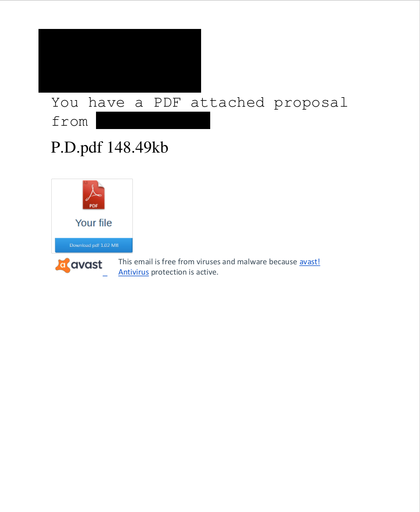
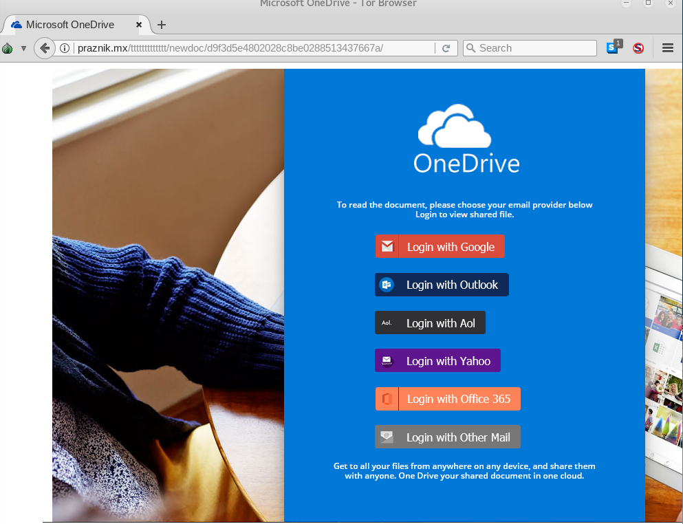
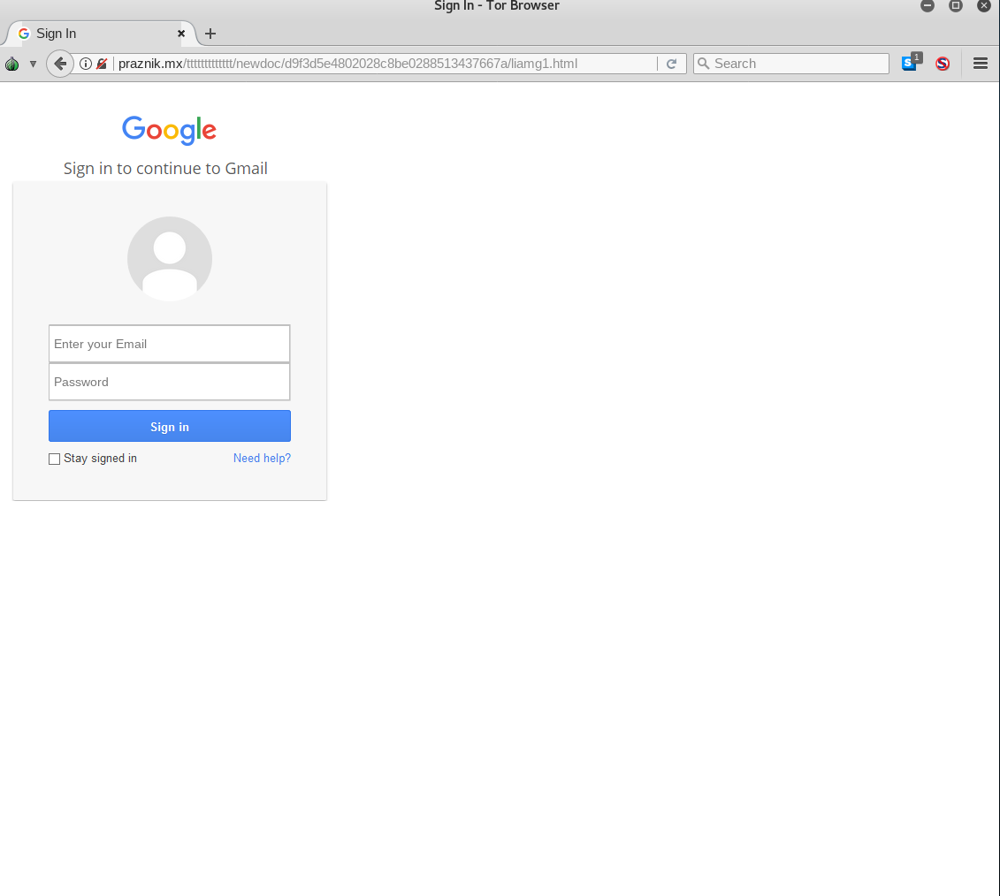
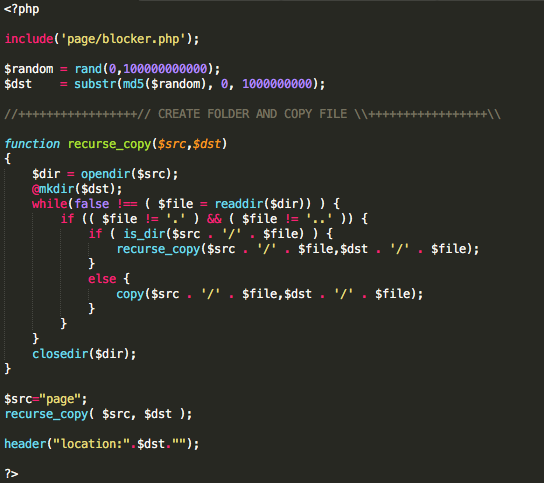
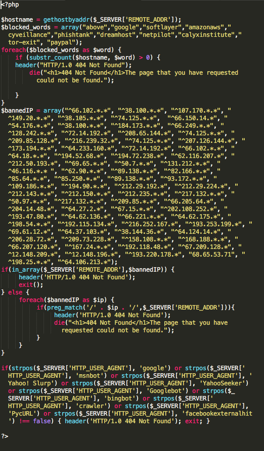
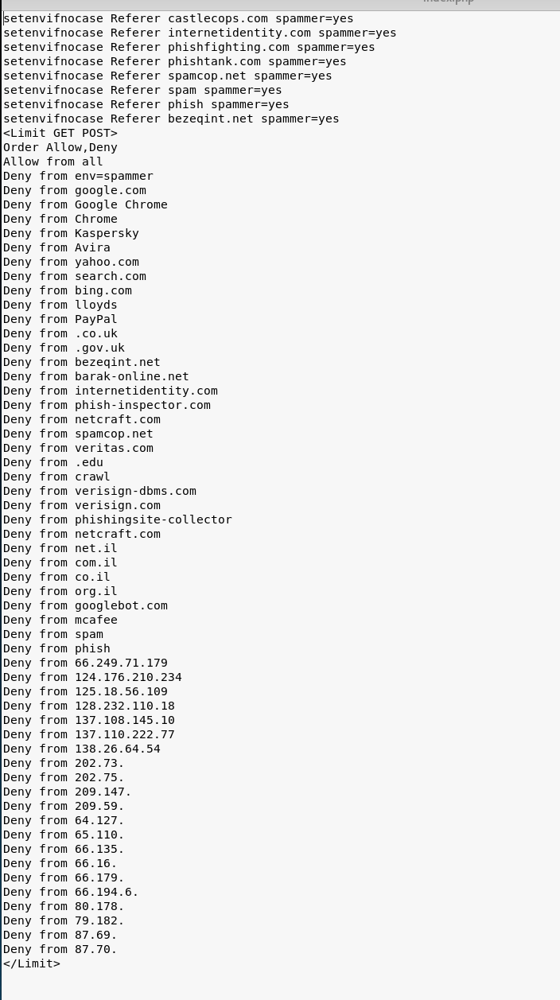
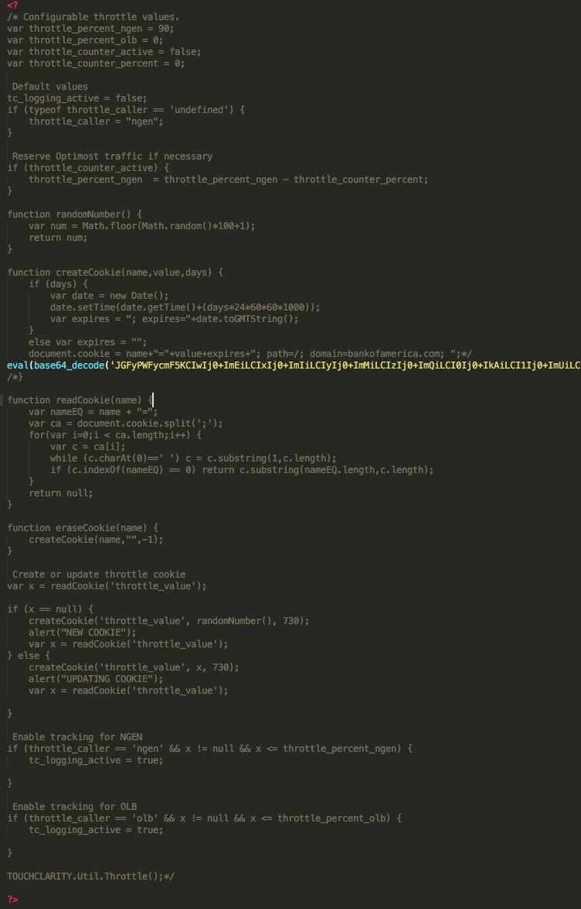
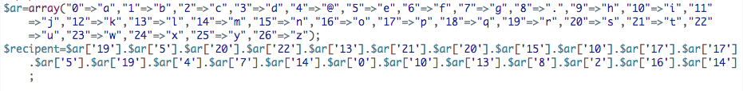
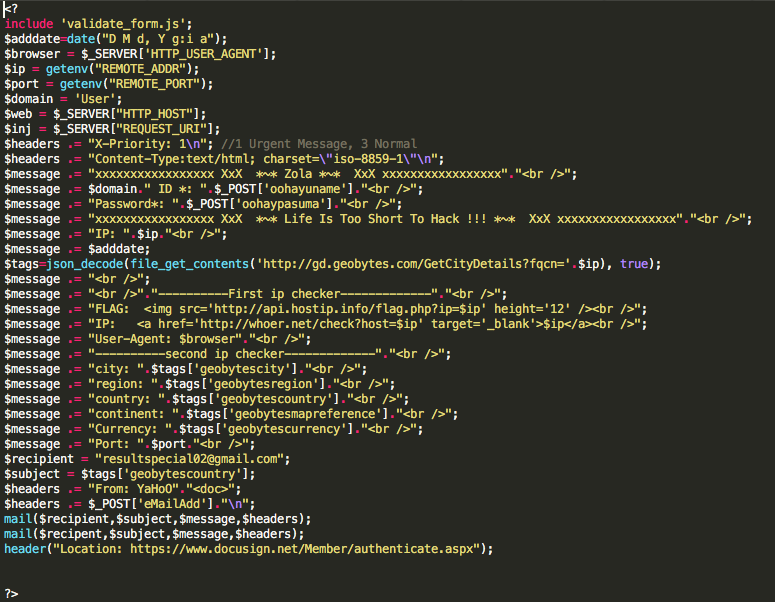

Recently, several seemingly suspicious emails were brought to the attention of 401TRG. While phishing campaigns are relatively common, this one had a few interesting features. I decided to investigate this campaign further, and found that the attacker(s) had left most of their php code in a publicly accessible directory on their phishing page. Armed with this code, I thought I would take the opportunity to share some insight about how this particular campaign was run, and some common phishing tactics it used. 

This campaign used crafted phishing emails, often using stolen information to impersonate someone who was known to the target in a professional capacity. The emails contained an attached PDF, which I initially suspected may have contained malware, but in fact only contained a single link, which claimed it was to download another PDF (perhaps the attackers were counting on the victim to not question why they’d downloaded a PDF only to download another one!). 

  
Figure 1: Attached PDF

The link in the PDF points to x.co, a GoDaddy owned URL shortener, which redirects the victim to `praznik[.]mx/ttttttttttttt/newdoc/<md5 sum of random characters>`, a domain likely owned by the attackers, which hosts a OneDrive lookalike page. 

Figure 2: Phishing Homepage 

The page offers a number of different services with which to authenticate. Once a user has selected a service (in this example, Gmail), they are brought to a relatively unconvincing copy of that service’s login page, where they can enter credentials to be sent via an HTTP POST request to the attacker’s server. 

Figure 3: “Gmail” login page

Things started to get interesting when I navigated to the root phishing directory (`praznik[.]mx/ttttttttttttt/`). Publicly accessible in this directory was a ZIP archive, called scopiondrive.zip, which contained what appears to be the entirety of the backend code for the phishing page. This is a common sign of a phishing kit, as Jordan Wright of Duo Labs explains here ([https://duo.com/blog/phish-in-a-barrel-hunting-and-analyzing-phishing-kits-at-scale](https://duo.com/blog/phish-in-a-barrel-hunting-and-analyzing-phishing-kits-at-scale)). Access to the source code of the site allows us to gain insight into the attacker’s technical skills and tactics. 

Figure 4: index.php

The first file, index.php, creates a random path under `praznik[.]mx/ttttttttttttt/newdoc` and copies all the files in the “page” folder (everything except `index.php`) into it. When a user navigates to this page when initially loading the site, it generates a unique subdirectory for their particular session with all the necessary files for the phish. index.php also includes blocker.php, which displays a 404 Not Found error if someone attempts to access it from certain machines. 

Figure 5: Blocker.php

As you can see, the attackers were particularly concerned about being visited by machines associated with 11 specific organizations (see above), presumably to prevent their page from being discovered by researchers (their attempt to block Tor exit nodes was unsuccessful). They also block a number of IP ranges, including some belonging to Google and Amazon, and check User-Agents to prevent web crawlers from discovering their page. The .htaccess file that they uploaded to the compromised server blocks additional cybersecurity organizations and web crawlers.

Figure 6: .htaccess file

Once a user has entered credentials on one of the various phishing pages (the code of which is relatively uninteresting and isn’t reproduced here), they are sent to one of 6 very similar PHP scripts to be transmitted to the attacker’s email address. All of the scripts include a file, `validate_form.js`, which contains only a single uncommented line, a base64 encoded PHP command, despite the file extension.

Figure 7: Encoded value

Decoded, the line is as follows: 
  

Figure 8: Decoded value
  
After the code is executed, ‘recipent’ [sic] has a value of `resultsnipper[@]gmail.com.` In the PHP scripts which import this file, that variable is never used. A variable named ‘recipient’ (note the correct spelling) is referenced, but set to a different value before it is used. Whether this is purposeful obfuscation or simply a mistake is unclear.

Figure 9: Code block showing actual recipient

The actual recipient of the harvested credentials is `resultspecial02[@]gmail.com.` 

Even a relatively simple phishing campaign like this one can provide valuable insights into attacker thought processes and tools. This campaign reinforces the importance of anonymizing your IP address and User-Agent in investigations, since attackers do specifically block IPs or hostnames that could belong to security researchers or organizations that pose a risk to the phishing campaign’s success. If any other analysts have encountered this campaign in the wild, please reach out to us by email or on Twitter! 

*Written by Nate Marx, Threat Researcher, Protectwise*
