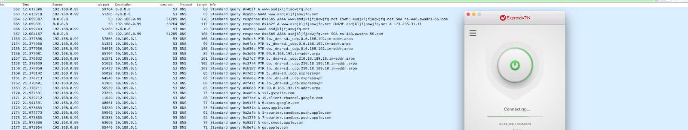
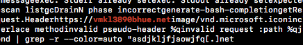
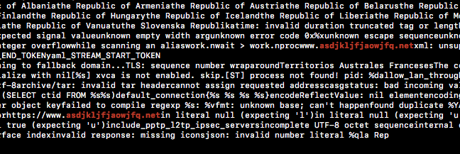

DNS is one of the most important protocols on the modern internet, and any incident responder must be intimately familiar with its inner workings to perform effective triage of almost any event. Most networks, regardless of security, must let at least some DNS traffic egress for the services they use to work properly, and malware authors often take advantage of this fact. Malware authors are not the only ones who find this property useful, however, and a large number of legitimate services exist which use DNS in a similar fashion, complicating the detection of malicious traffic. In this post, we will explore both malicious and benign but suspicious-looking uses of DNS to make it easier to tell them apart. 

To understand the difference between malicious and benign traffic, it is necessary to first understand the general ways in which malware uses DNS. Two of the most common malware uses of DNS are domain generation algorithms (DGA) and DNS tunneling/C2. There are a number of resources covering these two topics online, so we will only briefly discuss them here. Broadly speaking, DGA is when a piece of malware communicates not with a hardcoded C2 domain, but one that is generated algorithmically, and changes over time. These domains are usually distinct looking, and often contain strings of random looking characters. It is important to note that DGA is not restricted to generating random looking domains, however, and some algorithms use dictionary words to make the domains look less suspicious. The big advantage to malware authors in using DGA is that a single domain being shutdown does not mean they have lost control of their malware. Defenders attempting to shut down malware C2 by blacklisting domains will have a more difficult time since the domains can rotate so quickly. DNS tunneling, on the other hand, uses DNS itself for data transfer, taking advantage of the fact that most networks will query servers outside of the network for domains they don’t recognize. In the simplest case, the victim machine queries an attacker controlled DNS server, passing it data directly. However, even in an environment where communication via DNS is restricted to trusted servers, information can be tunneled out. A victim machine appends data to a subdomain of a domain whose DNS server(s) the attacker controls, and then sends this query to a DNS server on the victim network. The victim network DNS server will then have to send the request to the authoritative nameserver for the attacker controlled domain, and thus the attacker receives the data from the victim host. Data and commands can also be sent to a victim in this way by encoding them in the returned record. This traffic can also have a number of distinctive features, including the use of TXT records, random looking subdomains of suspicious domains, and subdomains encoded in base64 or NetBIOS encoding. 

While at first glance it may seem like both of these techniques should be distinctive enough as to be obvious to an incident responder, a number of pieces of legitimate software behave in ways that are very similar. Perhaps the most common of these is Google Chrome, which queries 3 random domains on startup, [as explained by the web developer Mike West](https://mikewest.org/2012/02/chrome-connects-to-three-random-domains-at-startup). While this is expected behavior to ensure proper operation of the Omnibox for certain types of queries, it can look very suspicious when it appears on your network. A key way to differentiate this from actual malicious traffic is to note that Chrome generated domains will only include root domains which are in your list of default DNS suffixes. For example, if the domain `company[.]com` is in your list of DNS suffixes, Chrome may generate a DNS query for `qlkjasdf` and `qlkjasdf.company[.]com`, but it will never generate a query for `qlkjasdf[.]com`. It is also notable that the malicious DNS scenarios mentioned above wouldn’t work with a subdomain under your control, unless that subdomain was compromised, since an attacker would not have access to the server where the data is being sent. 

Another common class of suspicious looking but ultimately benign traffic is endpoint protection software communicating with its infrastructure. For example, Sophos Extensible List will make [a number of different types of queries](https://community.sophos.com/kb/en-us/117936) to `sophosxl.net` for a variety of different reasons, including IP reputation lookups and ping latency checks. We have observed McAfee and Cymru using DNS in similar ways as well. This traffic can look similar to DNS tunneling (e.g. `4rzjp8zy7i7vawluximoxrko1p2tn58gj0fjjj2g.p.03.s.sophosxl.net`) because it is essentially using DNS in the same way as malware, though for a benign purpose. As long as the root domain is that of a known endpoint provider that is deployed on your network, this traffic can be classified as benign, though basic domain research and infrastructure analysis are still recommended to confirm. 

Finally, you may see two domains on your network, `vmklbhue3890[.]net` and `asdjkljfjaowjfq[.]net`, which at first seem to fit all the criteria of an algorithmically generated domain. They both resolve to IPs, but as of 9/29/17, both have privacy guards on their WHOIS information. Without further research, it would be reasonable to conclude that these were in fact malicious domains, generated by a malware DGA. However, these are actually benign queries performed by [ExpressVPN](https://www.expressvpn.com/) on startup. 

This can be confirmed by inspecting the string contents of `expressvpnd`, as shown below.

Accurately identifying malicious DNS can be a daunting task for network defenders, and this is by no means an exhaustive list of common benign but suspicious looking DNS traffic. Many other benign programs take advantage of the generally easy time DNS has transiting firewalls, and you may see other similar queries from different pieces of software. As always, the best course of action is thorough investigation of local traffic and external infrastructure to conclusively determine if a query is malicious or not.

*Written by Nate Marx, Threat Researcher, ProtectWise*
