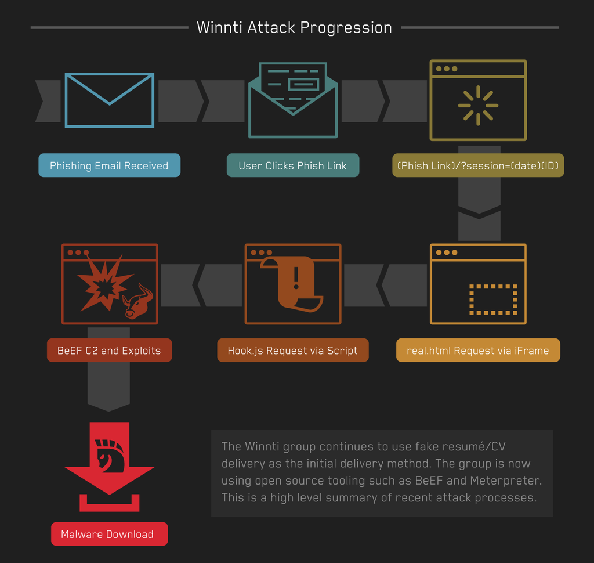
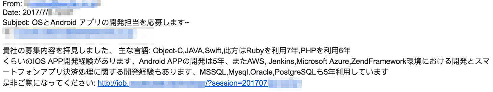
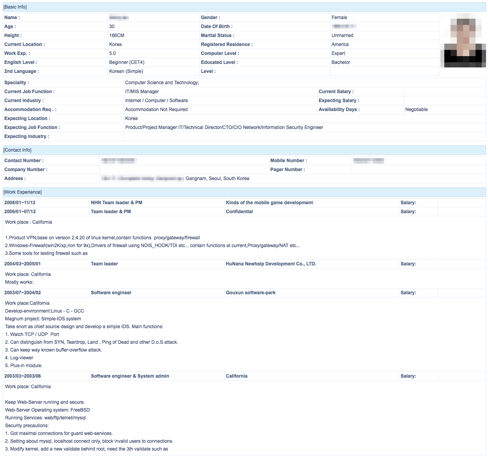
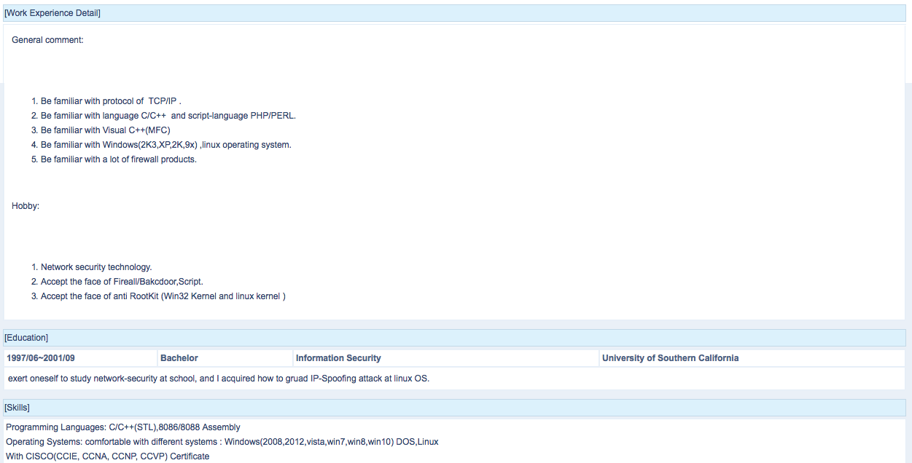
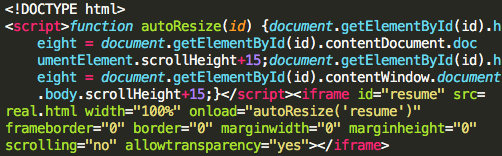

ProtectWise recently observed a burst of activity and change of tactics from an advanced actor group commonly referred to as “Winnti.” The purpose of this post is to share details of the group’s recent activity in an effort to assist the public in searching for related activity in their networks and preventing future attacks. 

## About Winnti

The Winnti group has been active since roughly 2010. Significant previous research has been published on the group from a variety of sources, such as Kaspersky, Blue Coat, and TrendMicro. As far back as 2011, the group was detected attacking multiple video game studios, including some in South Korea and Japan, likely attempting to steal various in-game currencies and to compromise developers’ certificates and source code. 

**Objectives:**
- Theft of digital certificates
- Use of stolen certificates to sign malware
- Theft of gaming source code and infrastructure details

**TTPs:**
- Known Toolset: PIVY, Chopper, PlugX, ZxShell, Winnti
- Phishing HR/recruiting emails for initial infection vector
- CHM email file attachments containing malware
- Use of GitHub for C2 communication

**Targets:**
- Online video game organizations
- Defense Sector
- Internet Service Providers

**Attribution:**
- Originating Location: China (high confidence)
- Potential Aliases: Wicked Panda, APT17

## Evolution of Winnti - Open source tools, and Mac OS targeting:

Within the Winnti campaigns observed by ProtectWise, the use of open source tooling was common. Specifically, the group has been utilizing the Browser Exploitation Framework (BeEF) and Metasploit Meterpreter. The use of open source tools by advanced actor groups has become increasingly common, as discussed by our colleagues in the industry. To the best of our knowledge this is a new technique for the Winnti group and we expect it to be used in future attacks. 

Also noteworthy are attempts to deliver JAR files containing macOS applications which have meterpreter functionality. In addition, victims running Windows were delivered MSI files which were built using a free EXE to MSI converter [http://www.exetomsi.com/](http://www.exetomsi.com/).

  
## Delivery:

The Winnti campaign detailed in this post began with spear phishing emails aimed at a Japanese gaming studio’s staff. At least one of these emails claimed it was from an applicant for a job posting who was listing their relevant experience, along with a link to their resume. 

  
The approximate translation of the Winnti phishing email is as follows: 
> “I saw your job posting. My main languages are Object-C, JAVA, and Swift, and I have 7 years experience with Ruby and 6 years experience with PHP. I have 5 years experience developing iOS apps, as well as Android apps, AWS, Jenkins, Microsoft Azure, ZendFramework, and smartphone application payment processing. I also have 5 years experience with MSSQL, Mysql, Oracle, and PostgreSQL. Please see here: <URL>”

We observed Winnti using two different techniques when the link was clicked. In the first technique, the user was directed to an HTML page which loaded a fake English resume. In the second technique, which we only observed a few times, the landing page directly downloaded a JAR file to the victim’s machine. 

## Landing:

In cases where the above resume is loaded, it is delivered as follows:

`{Phishing Email Link}/?session={date}{ID}`
This page is an HTML file containing a simple iframe instruction to load `real.html`.

  
#### real.html
This is the HTML file containing the fake resume which will load in browser for the link-click victim. It contains a script which loads the BeEF hook script from a separate external host. The group’s infrastructure changes rapidly, occasionally allowing us to observe them modifying the hook page destination domain over the span of a few minutes. Sometimes the same destination would be referred to by IP in one version of real.html and by hostname in another. Two additional files, `resume_screen.css` and `mypic.jpg`, are also loaded to make the resume look more realistic with improved formatting. 

 
At this point, in cases where BeEF has been used, exploits are typically attempted on victim hosts with the help of BeEF modules. A commonly used module was Jenkins_groovy_code_exec. 

## Evasion Techniques:

One of the Winnti group’s distinctive techniques is their particular style of DNS resolution for their C2 domains. Choosing domain names which are similar to valid domains (for example, `google-statics[.]com`, a misspelling of Google statistics, instead of `analytics.google.com`), the group configures their DNS so that the root domain resolves to either nothing, or localhost (previous research has observed the root domain resolving to the valid domain it is imitating; we did not observe that in this campaign). Then a subdomain resolves to an actual C2 server. For example, `google-statics[.]com`, one of the C2 domains observed in this campaign, has no resolutions at time of writing. `css.google-statics[.]com`, however, resolves to a real C2 IP. 

As observed in previous Winnti attacks, the group uses commonly accepted and poorly monitored protocols and ports for their C2 communication (ports 53, 80, 443). With the addition of BeEF, the group has made use of TCP port 8000 as well. Amusingly, the group's use of BeEF has been fairly rudimentary, not even taking advantage of the basic obfuscation features included in the program. We observed the group using GAGAHOOK instead of the default BEEFHOOK session name and BEEFSESSION session cookie name.

As in previous Winnti campaigns, the group continues to use legitimate code signing certificates, stolen from online gaming organizations, to sign their malware. This technique can help to hide the malicious intent of the group’s code, allowing it to run in environments where execution is restricted to signed/trusted programs. While unconfirmed as of this writing, we believe the Winnti group is continuing to steal and use certificates from new organizations. 

All indicators for this report are located at our [github detections repository.](https://github.com/401trg/detections)

*Written by Tom Hegel, Senior Threat Researcher, Protectwise and Nate Marx, Threat Researcher, Protectwise*
